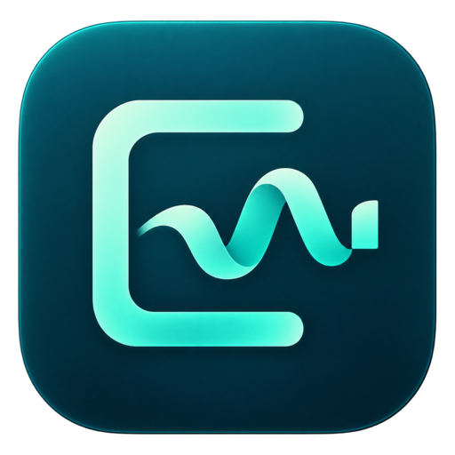

<p align="center"></p>

# ClearTake

A local screen recorder and editor for the moments you want to keep.

**Record → review sounds → mute or cut → export MP4.**

ClearTake 0.1 is a new, independently written implementation with a new interface. This directory contains no source code, interface assets or project structure copied from Recordly. It uses the third-party libraries listed in [THIRD-PARTY.md](THIRD-PARTY.md). The previous fork is a separate project and its project files are not compatible; import an exported video to edit it here.

## What you can do

- Record a screen or window, with optional microphone, computer audio and webcam.
- Pause and resume recording.
- Find possible sneezes, coughs, throat clearing and sniffs with a local sound model.
- Listen to suggestions; enable, disable or remove each edit.
- Drag across the waveform or enter start/end times to select **any** unwanted moment.
- **Mute sound:** silence the selected audio while keeping the picture.
- **Cut from video:** remove the selected time from both picture and sound.
- Mute microphone only, or all audio. Separate microphone and computer volume controls.
- Trim the beginning/end, change speed, and apply gentle microphone noise reduction on export.
- Choose landscape, portrait or square framing, a background color, padding and center zoom.
- Move and resize the webcam overlay.
- Add an opening title; import SRT captions timed to the original video. Captions follow cuts and speed changes.
- Undo/redo edits, reopen saved projects, listen to the original, render a preview and export MP4.

Original media is retained. Edits live in a project file until you render/export. There are no accounts, subscriptions, API keys, analytics or recording uploads.

## Build the Mac installer

**Apple Silicon (M1 or newer), macOS 14.2 or later.** Computer audio availability also depends on macOS permissions and the chosen capture source.

1. Extract this project to a new folder, separate from your previous ClearTake source.
2. If needed, install [Homebrew](https://brew.sh), then run:

   ```sh
   brew install node@22 python@3.12
   ```

3. Open Terminal in this folder and run:

   ```sh
   bash Build-Mac.command
   ```

The script installs dependencies, downloads the local sound model, bundles the Python detector, runs checks and creates:

```text
release/ClearTake-Independent-0.1.0-arm64.dmg
```

The first build downloads several large dependencies and needs several GB of free disk space. CMake and Swift build tools are not needed by this implementation. No model/API credentials are needed. Subsequent app recording and sound analysis run locally.

Open the DMG and drag **ClearTake** into Applications. It has a new application ID. Replacing a previous application with the same display name does not delete its recordings; keep those recordings backed up. macOS will ask for Screen Recording, Microphone and Camera permissions as applicable. If macOS blocks your own unsigned development build, use **System Settings → Privacy & Security → Open Anyway**, then reopen it. Do not disable Gatekeeper globally.

The development DMG uses ad-hoc signing. Apple Developer signing and notarization are separate distribution steps and are not configured. This source package was prepared and media-tested on Linux; native Mac capture and DMG installation still require testing on a Mac.

## The easiest way to edit a sneeze

1. Stop the recording. The editor opens, and detection runs if its checkbox was enabled.
2. Click **Listen** beside a possible sneeze. This plays the original around that moment.
3. Choose **Mute sound** to keep the video, or **Cut moment** to remove the entire moment. Check the row to apply it. Uncheck it to restore that moment.
4. If detection missed it, drag across that sound on the waveform and click **Mute sound** or **Cut from video**. Times are in seconds in the original recording.
5. Turn off **Listen to original** and play your edit. Use **Render preview** to hear export noise reduction and see the final composition.
6. Click **Export MP4**, choose a destination outside the project folder, and share that exported file.

A sneeze visible on camera remains visible when you mute it. Use **Cut from video** to remove the picture too.

## What automatic cleanup means

The microphone option requests Chromium noise suppression by default. Additional gentle noise reduction is enabled for microphone export by default. Computer audio recording is **off** by default; turn it on if you want the audio from applications.

The sound model analyzes the first 60 minutes after recording. Strong candidates with low nearby speech scores are checked for muting; uncertain candidates and candidates near speech are left unchecked for review. These thresholds are heuristics, not guarantees. The model can miss sounds, mistake speech for a sound, or flag neighboring words. It does not identify the intended speaker or reliably separate overlapping people. It does not remove sneezes from raw captured files in real time. Review the result before publishing.

Manual mute/cut works for any selected time and for the entire recording. Mute silences a track at that time; it cannot preserve speech overlapping the unwanted sound on the same track. Imported videos usually have one mixed audio track, so voice and background audio cannot be separated there.

The quick editor preview skips cuts and applies mutes. Gentle noise reduction and volume above 100% are heard in **Render preview** and exports. Final text sizing and crop rounding can differ slightly from the quick preview.

## Projects and privacy

Projects are saved under your macOS Movies folder in **ClearTake Projects**, with one subfolder per recording. Each contains original media, normalized playback media and `project.cleartake.json`. **Show project files** reveals the folder. Keep the complete folder to reopen or move a project. Incomplete recordings remain in the list with a recovery link to the files.

Imported videos are copied and converted into a playable H.264 MP4. The source you imported remains unchanged. Exported files contain the enabled edits; project files and raw recordings can still contain unwanted sounds. Share the exported MP4, not the raw project, when those sounds must stay private.

## Publish the source on GitHub

Create an empty repository in your account. From this source folder:

```sh
git init
git add .
git commit -m "Initial independent ClearTake editor"
git branch -M main
git remote add origin https://github.com/YOUR-ACCOUNT/ClearTake.git
git push -u origin main
```

The included `.gitignore` excludes dependencies, local models and build output. It does not include your recordings, which live outside this source folder. Keep `LICENSE`, `THIRD-PARTY.md` and the asset provenance note.

To build on GitHub, enable Actions and run **Build ClearTake DMG** manually from the Actions tab. Download its **ClearTake-Apple-Silicon** artifact when successful. The workflow creates a build artifact; it does not publish a release. Your repository must have access to a macOS ARM64 runner. When distributing binaries, also provide the applicable third-party notices and corresponding FFmpeg source/build information described in THIRD-PARTY.md.

## Development and tests

```sh
npm ci
npm start
npm test
python3 tests/sound_test.py
```

Detection in development requires `.build/venv` and `.build/yamnet`, created by the Mac build script. Recording/manual editing can run without that detector; the UI explains when it is missing. Set `TEST_FFMPEG` and `TEST_FFPROBE` if the binaries are not in `/usr/bin`. The Mac build script sets them automatically and tests the bundled detector before and after packaging.

The app's main-process entry is `app/main.cjs`. Its isolated UI is under `app/ui`. Editing, export, projects and detection are separate small modules under `engine`. There is no hidden dependency on a previous app's source tree.

## First-release boundaries

This is a working source implementation, not a claim of complete feature parity with professional editors. It does not yet include multitrack clip rearrangement, transitions, automatic cursor zoom, zoom keyframes, face tracking, speech transcription, speaker isolation, blur/redaction, effects plug-ins or cloud sharing. Caption import is supported; automatic caption generation is not. This build targets Apple Silicon only. Verify native permissions, recording sync, long recordings and installation on the target Mac before a public binary release.

Application code: [MIT](LICENSE). Bundled third-party components retain their own licenses.
